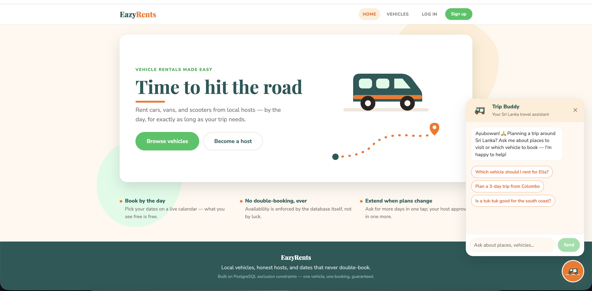
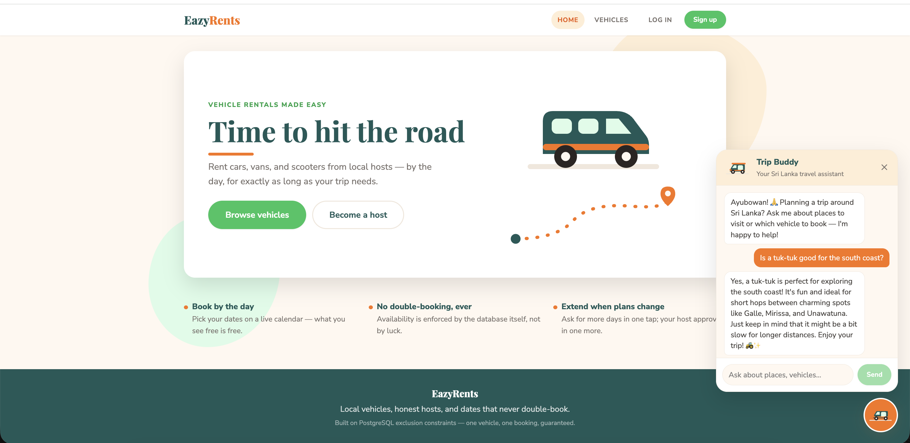
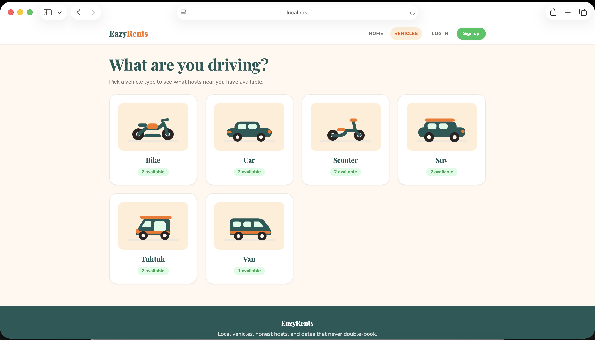
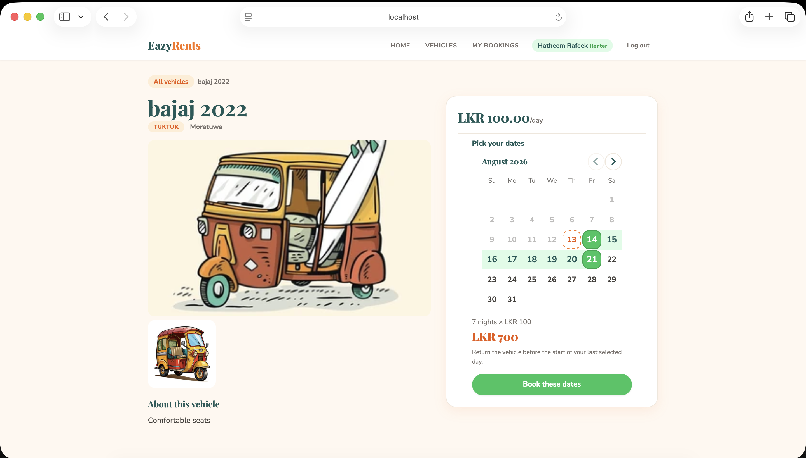
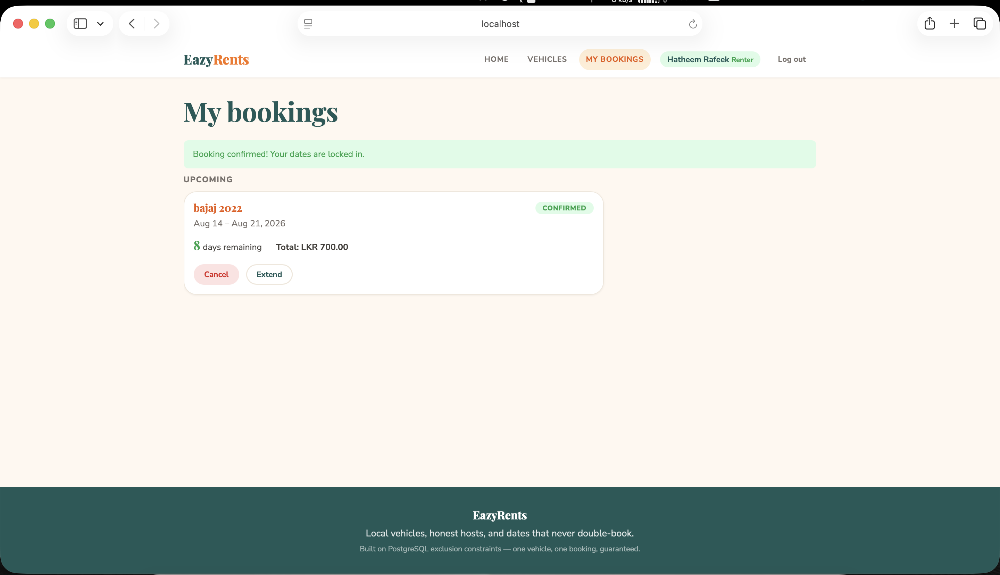
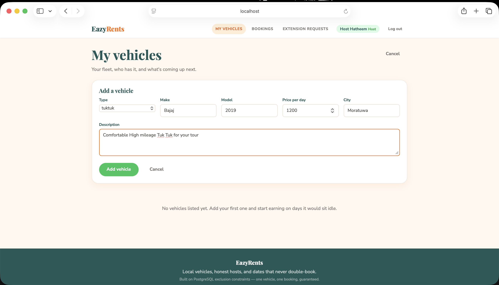
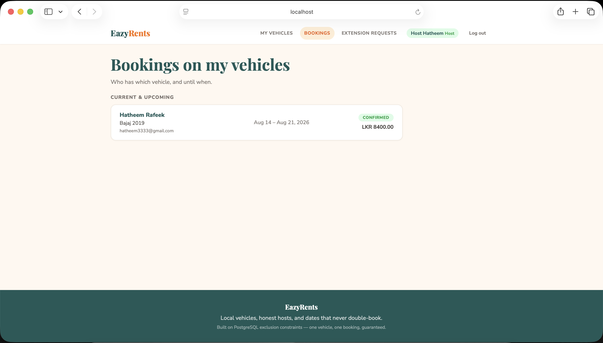
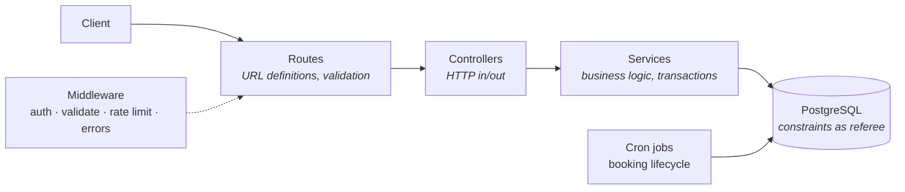
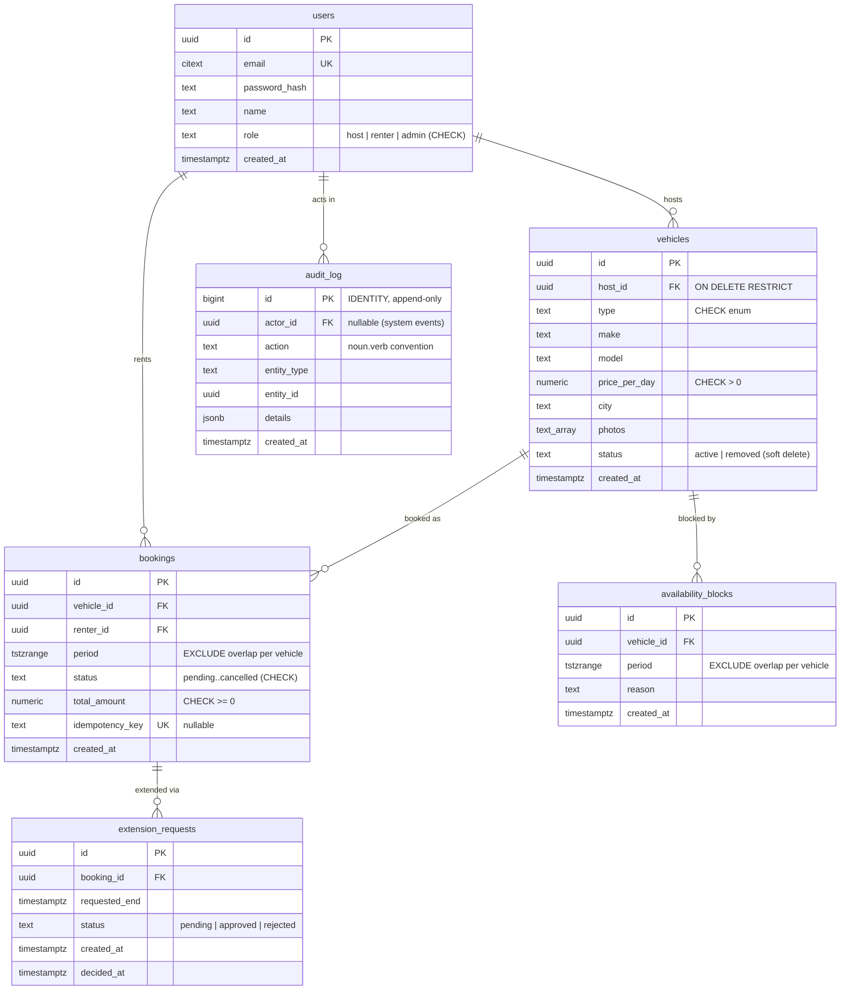

# EazyRents 🚗🛺

**A full-stack peer-to-peer vehicle rental platform for tourists exploring Sri Lanka — with an integrated LLM-powered travel assistant.**

Hosts list vehicles (cars, vans, SUVs, bikes, scooters, and tuk-tuks), set prices, and block out unavailable dates. Renters — primarily tourists — search, filter, book for a date range, request extensions, and cancel. A built-in AI assistant, **Trip Buddy**, helps visitors plan their Sri Lankan trip and pick the right vehicle for it.

The project has two engineering focal points:

1. **Correctness under concurrency** — double-booking is made *impossible at the database layer* using PostgreSQL exclusion constraints, not just checked in application code.
2. **Right-sized LLM integration** — a domain-scoped, prompt-engineered assistant built with cost, abuse, and safety controls, deliberately kept as simple as the problem allows.

---

<table width="100%">
  <!-- Row 1 -->
  <tr>
    <td align="center" width="33.3%"></td>
    <td align="center" width="33.3%"></td>
    <td align="center" width="33.3%"></td>
  </tr>
  <!-- Row 2 -->
  <tr>
    <td align="center" width="25%"></td>
    <td align="center" width="25%"></td>
    <td align="center" width="25%"></td>
    <td align="center" width="25%"></td>
  </tr>
</table>

---

### Trip Buddy — AI travel assistant 🛺
A floating, animated tuk-tuk button (drawn in the app's own flat-cartoon SVG style) sits on every page. Clicking it opens a chat panel where visitors can ask things like *"Which vehicle should I rent for Ella?"* or *"Plan a 3-day trip from Colombo."*

Design highlights:
- **Domain-scoped via system prompt** — the assistant is prompt-engineered (OpenAI `gpt-4o-mini`) with the platform's actual vehicle types, Sri Lankan destinations and seasons, and vehicle-to-route heuristics (tuk-tuks for coastal hops, vans for group hill-country tours). It politely declines off-topic requests and never invents listings or prices.
- **Stateless server** — the client sends the visible conversation each turn; no chat state or extra tables server-side.
- **Cost & abuse controls** — public (no login required) but defended: zod-validated message schema (≤ 20 messages × ≤ 1000 chars), reply token cap, and a dedicated per-IP rate limit (30 req / 15 min).
- **Graceful degradation** — if no API key is configured the server still boots and only `/chat` returns 503; upstream OpenAI failures are logged server-side and surfaced as a friendly 502.
- **Accessible UI** — Escape-to-close, focus management, ARIA labels, and `prefers-reduced-motion` support scoped to the widget.

## Architecture

Layered architecture with strict responsibilities — routes define URLs, controllers translate HTTP, services own business logic, and a single db module owns the connection pool. Controllers never touch the database; services never touch `req`/`res`.



Cross-cutting concerns live in middleware: JWT verification (`requireAuth`), role checks (`requireRole`), zod validation, rate limiting on auth routes, and a single global error handler that logs details server-side while returning generic messages to clients.

## Data model



Design notes: money is `numeric(10,2)` (never float), emails are `citext` (case-insensitive uniqueness), deletes are `RESTRICT`ed and vehicles are soft-deleted so historical bookings keep valid references, and the audit log is append-only by design — corrections are new entries, never edits.

## The double-booking problem

The core invariant — *one vehicle cannot have two overlapping confirmed bookings* — is enforced by PostgreSQL itself, not by application code:

```sql
ALTER TABLE bookings ADD CONSTRAINT no_overlapping_bookings
  EXCLUDE USING gist (
    vehicle_id WITH =,
    period WITH &&
  )
  WHERE (status IN ('confirmed', 'active'));
```

Read as: *no two rows may exist where the vehicle is the same AND the periods overlap, considering only confirmed/active rows.*

- **`tstzrange` with half-open semantics `[start, end)`** — back-to-back rentals share a boundary instant without conflicting, and overlap is the built-in, index-accelerated `&&` operator instead of hand-written date math scattered across queries.
- **The partial `WHERE`** means cancelled and completed bookings automatically release their dates — no cleanup code exists because none is needed.
- **GiST-backed** — the constraint is enforced atomically inside the engine, so it holds under any concurrency, from any client, even direct `psql` access, even buggy application code. The same index accelerates availability queries.
- Exclusion constraints cannot span tables, so booking-vs-block conflicts are checked **inside the booking transaction** (after a `SELECT ... FOR UPDATE` on the vehicle row). Constraints for intra-table rules; transactions for cross-table rules.

### Proof under concurrency

`scripts/concurrency-test.js` fires **20 simultaneous** booking requests for the same vehicle and dates:

```
201: 1, 409: 19
```

```sql
SELECT count(*) FROM bookings
WHERE period && tstzrange('2027-03-01','2027-03-05') AND status = 'confirmed';
-- count = 1
```

Exactly one winner, nineteen clean conflicts, zero corruption.

<!-- TODO: insert screenshot of the failing overlap INSERT from psql -->
<!-- TODO: insert screenshot of the concurrency script output -->

## ACID mapping

**Atomicity** — every multi-step write is one transaction. Creating a booking locks the vehicle row, checks availability blocks, computes the price server-side, inserts the booking, and writes an audit entry — all-or-nothing. Extension approval widens the booking period, recomputes the total, and marks the request in a single unit; if the widened period collides with a later booking, the whole transaction rolls back and the request remains `pending`.

**Consistency** — invalid states are unrepresentable. CHECK constraints (roles, statuses, vehicle types, positive prices, non-empty periods), UNIQUE constraints (email, idempotency key), foreign keys with `ON DELETE RESTRICT`, and the exclusion constraint together define validity, and PostgreSQL refuses any transition outside it — regardless of which code path (or human) attempts the write.

**Isolation** — two layers. `SELECT ... FOR UPDATE` serializes writers touching the same vehicle, so concurrent bookings and blocks queue at the row lock. Beneath that, the GiST exclusion constraint arbitrates simultaneous inserts inside the engine itself. Defense in depth: remove the locking code entirely and double-booking is still impossible. The concurrency test is the empirical evidence.

**Durability** — a committed booking is in the write-ahead log on disk before the client receives `201`; a crash a millisecond later loses nothing. (Production-grade durability additionally requires backups and replication — see roadmap.)

## Security

- **Passwords:** bcrypt (cost 12); the hash never leaves the service layer, is never logged, never returned.
- **Auth:** short-lived stateless JWTs (`{ sub, role }`), secret from environment; precise `401` (unauthenticated) vs `403` (unauthorized) semantics.
- **User-enumeration defense:** identical `401 invalid credentials` for wrong-password and unknown-email, plus a dummy bcrypt compare to equalize response timing.
- **Object-level authorization (OWASP API #1):** ownership enforced *inside* the SQL (`WHERE id = $1 AND host_id = $2`) — one atomic statement, no check-then-act gap; `404` instead of `403` for others' resources so attackers cannot confirm resource existence.
- **Mass-assignment defense:** the acting user's id always comes from the verified JWT, never the request body; clients cannot set `total_amount` — prices are computed server-side inside the transaction.
- **Privilege escalation blocked:** registration's zod enum accepts only `host | renter`; `admin` is unreachable from the API.
- **SQL injection structurally impossible:** 100% parameterized queries, including dynamically built filters and partial updates.
- **Race-condition-free uniqueness:** no SELECT-then-INSERT; the code inserts and translates constraint violations (`23505` → 409 duplicate email, `23P01` → 409 booking conflict). The database is the referee; the app handles the referee's decision.
- **Brute-force protection:** rate limiting on `/auth/*`; `helmet` security headers; CORS pinned to a configured origin.
- **No information leakage:** central error handler returns generic messages, logs full detail server-side; pino redacts `Authorization` headers and passwords at the logger level; secrets live in `.env` (gitignored, documented via `.env.example`).
- **Idempotency:** `Idempotency-Key` header on booking creation — a retried request returns the original booking instead of creating a duplicate.

## Operations

- `GET /healthz` probes the database (`SELECT 1`) and degrades to `503` without crashing — load-balancer ready.
- **Graceful shutdown:** on SIGTERM the server drains in-flight requests, stops cron jobs, closes the pool, then exits (10s force-kill safety net) — enabling zero-downtime deploys.
- **Booking lifecycle jobs (node-cron):** `confirmed → active` when the period starts, `active → completed` when it ends — each a single atomic `UPDATE ... WHERE ... RETURNING`; an hourly "ending soon" job is made idempotent by checking the audit log before writing.
- **Structured logging:** pino request logs with sensitive fields redacted.
- **Append-only audit trail:** who did what, when, with a `jsonb` payload — system events (cron) log with a null actor.

## Running it

**Prerequisites:** Node 20+, PostgreSQL 15+ (Postgres.app on macOS works out of the box).

```bash
# 1. Create the database
psql -c "CREATE DATABASE eazyrents;"

# 2. Configure
cp .env.example .env        # fill in DATABASE_URL and JWT_SECRET
# generate a strong secret: openssl rand -hex 64

# 3. Install, migrate, seed
npm install
npm run migrate up
npm run seed                # demo hosts, renters, vehicles, bookings

# 4. Run
npm run dev                 # nodemon, http://localhost:3000
```

**Quickstart:**

```bash
curl http://localhost:3000/healthz

# log in as a seeded renter (see seed output for credentials)
curl -s -X POST http://localhost:3000/auth/login \
  -H "Content-Type: application/json" \
  -d '{"email":"renter1@seed.test","password":"password123"}'

# browse vehicles
curl "http://localhost:3000/vehicles?type=van&city=colombo"

# book one (Bearer = token from login)
curl -X POST http://localhost:3000/bookings \
  -H "Authorization: Bearer <token>" \
  -H "Content-Type: application/json" \
  -d '{"vehicleId":"<id>","startDate":"2026-12-01T00:00:00Z","endDate":"2026-12-05T00:00:00Z"}'

# prove the concurrency guarantee
node scripts/concurrency-test.js
```

## API reference

| Method | Path | Auth | Role | Description |
|---|---|---|---|---|
| GET | `/healthz` | — | — | Liveness + DB probe |
| POST | `/auth/register` | — | — | Register (`host` or `renter` only) |
| POST | `/auth/login` | — | — | Login → JWT |
| GET | `/vehicles` | — | — | Search: `type, city, minPrice, maxPrice, page, limit` |
| GET | `/vehicles/:id` | — | — | Details + `unavailable_dates` |
| POST | `/vehicles` | ✓ | host | Create vehicle |
| PATCH | `/vehicles/:id` | ✓ | host (owner) | Partial update |
| DELETE | `/vehicles/:id` | ✓ | host (owner) | Soft delete |
| POST | `/vehicles/:id/blocks` | ✓ | host (owner) | Block a date range |
| DELETE | `/vehicles/:id/blocks/:blockId` | ✓ | host (owner) | Remove a block |
| POST | `/bookings` | ✓ | renter | Book (supports `Idempotency-Key`) |
| GET | `/bookings/mine` | ✓ | renter | My bookings + days remaining |
| POST | `/bookings/:id/cancel` | ✓ | renter (owner) | Cancel (state-machine guarded) |
| POST | `/bookings/:id/extension` | ✓ | renter (owner) | Request extension |
| GET | `/host/bookings` | ✓ | host | Who has which vehicle, until when |
| POST | `/extensions/:id/approve` | ✓ | host (owner) | Approve (constraint-guarded) |
| POST | `/extensions/:id/reject` | ✓ | host (owner) | Reject |

Errors use a consistent shape: `{ "error": { "message": "..." } }` (validation failures include field details). `409` signals a conflict (dates taken, duplicate email); `404` covers both not-found and not-yours by design.

## Project structure

```
src/
├── server.js           # app wiring, health check, graceful shutdown
├── db/index.js         # single pg.Pool + query helper
├── routes/             # URL definitions + zod schemas
├── controllers/        # HTTP translation only
├── services/           # business logic & transactions
├── middleware/         # auth, validate, rate limit, error handler
└── jobs/               # booking lifecycle cron
migrations/             # versioned schema (node-pg-migrate)
scripts/                # seed.js, concurrency-test.js
```

## Roadmap

- Refresh-token rotation (httpOnly cookies) alongside the short-lived access token
- Payment records with the same idempotency pattern; webhook handling
- Redis: hot search caching + distributed rate limiting
- Read replica for search traffic; PgBouncer connection pooling
- Docker Compose (api + postgres) for one-command setup; CI with GitHub Actions
- Automated integration tests for the booking service's conflict paths
- React frontend consuming this API
- Geospatial search (PostGIS) and photo upload (object storage)
